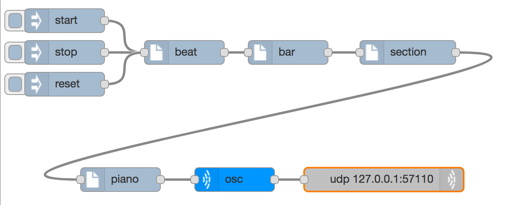
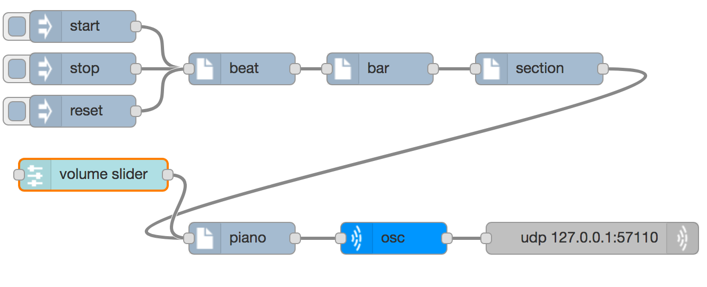
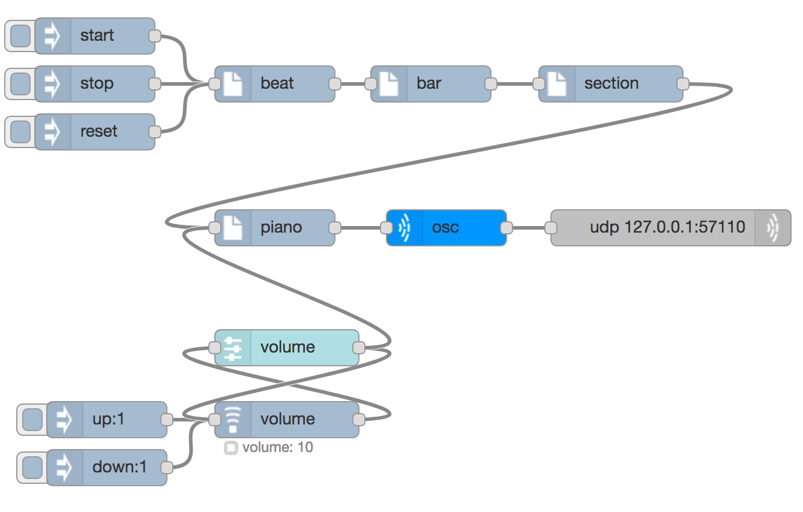
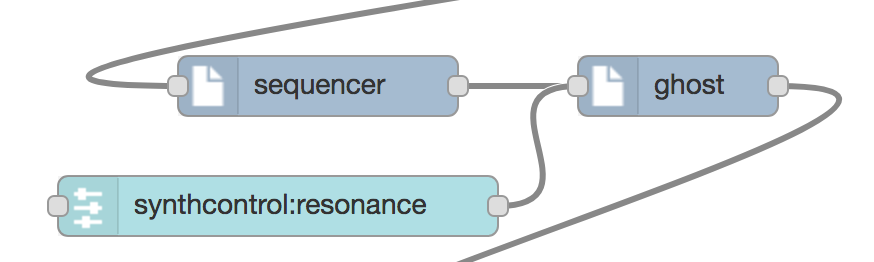

# Controlling Synths


## Volume controls

All the synths that we use have a volume control, which goes from 0 to 100, and you can control this either through configuration or by sending a message to the synth with the `volume` as the message `topic`. This allows us to change the volume of the synth while it is running.

One way of allowing us to change the pitch is to build a User Interface (UI) component. To demonstrate this, first of all connect a `beatgenerator` (imported) to a piano synth and then an imported `supercolliderOSC` to play a piano note repeatedly like this



Next add a `slider` node from the _dashboard_ section of the palette. We want this to create messages with the topic `volume` when the slider is dragged. The configuration for the slider looks like this


You have to specify a sensible range for the values (in this case 0 to 100) and a topic for the messages it sends (in this case `volume`). If you want you you can also change `Label`, which is how it will be shown in the UI, and `Name`, which is how it is shown in the workspace. You will also get complaints from node-red about it not being configured correctly if you don't provide a `Group` that it belongs to, which may have to be a `new ui_group` if you haven't built one before.

Although the slider can receive inputs, which will update the value, we don't need this here, we just connect the output od the slider to the input of the synth (or synths) that we want to control, so we get a flow like this:



But when you deploy this and start the beat, no slider appears. This is because the user interface (UI) is provided on another page. Open a new tab on the browser and enter the URL

```http://127.0.0.1:1880/ui```

There you will see a slider which you can drag up and down to change the volume of the synth. If you add more UI components to your flows then they will also appear in the UI.

In the `music` section of the palette there is a another node type called `setting` which you can use to remember and control values. The difference is that instead od responding to UI actions like dragging a slider, it responds to incoming messages like `up:5`. Here the `topic` is `up` and the payload is `5`. The `setting` node has to be configured with a `setting` (which is used as the topic of the messages it sends) as an initial value, and a minumum and maxiumum value.

If you import the `volume control` flow, you will get a `setting` node and a `slider` node tied together, so that if one changes then the other is changed too. There are also inject nodes for turning the volume up and down. If you connect the output of either the `slider` or `setting` nodes to the input of a `synth`, you can control the volume of the synth either way with a flow like this.



## Tempo controls

You can also control the tempo via a slider, by using a `topic` of `bpm` and sending the messages to the input of the `beat` node. Again you can import another volume control, and change the `setting` and `slider` nodes to say `bpm` instead of `volume` (in several places) so you can control the speed of the beat either with messages or with a slider.

## Synth types and synth parameters

All synths have a volume control, and the pitch is controlled by the `note` value that is sent. Some synths have other controls too, which allow for closer control of the timbre of the sound.

A good example of this is the `ghost` synth. It works by generating "White noise" and filtering out some of the higher sound frequencies. The filter that is used also allows for some _resonance_ so that a clearer note emerges. We can control this by sending messages with topic `synthcontrol:resonance` and a `payload` value between 0 and 100. This can all be done with a slider like this:



Otherwise you could import a `volumecontrol` and change all the `volume` configurations to `synthcontrol:resonance`.

Other synth types also have parameters you might like to change with a `synthcontrol:` topic, such as

* `snare` has a parameter `snare_brightness` which you can vary from 0 to 1000
* `kick`  has a parameter  `sustain` which you can vary from 0 to 1 (you will want to make the step size something like 0.01) and a parameter `beater_noise_level` which can vary from 0 to 0.1
* `blip` has parameters `att` and `rel` which control the attack time and release time - the amount of time in seconds it takes for the sound to start and end. The standard values are 0.01 for `att` and 1 for `rel` but you could make them any range you wanted
* `prophet` has many parameters, including `lforate`, which is usually 10

# Automated control

If you have a piece of music you have developed, you could apply volume or tempo changes throughout the piece by dragging sliders or clicking on inject nodes, but that may be unsatisfactory for a few reasons

* it is difficult to do a very slow and controlled change with a slider
* you might need to change more than one thing at once
* automating things is what computers are good at

One way to do this is to use the beats that are created to create regular messages increasing or decreasing the volume, or some other control value. Taking the output of the beat generator directly will not work because we need to have a message that has topic `up` and payload `1`, but the beat messages have no topic and a payload of `tick`. To make this work we can use the standard node `change`, which is in the _function_ group of the palette.

With all of these features of sound that you can control,you have enough knowledge to try [creating](creating) a larger piece of music.