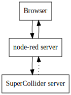

# Getting Started

* [Connecting the parts](#connecting)
* [Starting the software](#starting)
*

## <a name='connecting'></a>Connecting the parts

* Work in pairs
* Get together the things you will need (per pair)
- a Raspberry Pi (RPi) computer
- a RPi power supply (looks like an android phone charger)
- a monitor and HDMI lead/converter
- a keyboard
- a mouse
- two pairs of headphones
- a headphone splitter
- a speaker with power lead and audio lead
* Plug it all together, for now plugging the headphone splitter into the headphone socket and the speaker disconnected
* Switch on the power

You should end up with a screen that looks like this:


This is the Operating System (OS) called Linux, which has similar functions to Windows. Linux is also the basis of the Android operating system used on some mobile phones. The hardware used on the Raspberry Pi is also commonly used in mobile phones, which is why it is so compact.

## <a name="starting"></a>Starting up the software

There are three programs that need to be running:

* web broswer
* node-red server
* SuperCollider server

The node-red server is a web server, although in this case it is running on the same computer as the web browser. So your web browser sends requests to the node-red server, and the node-red server sends responses back. The SuperCollider server is essentially a synthesiser, and it gets its instructions about which sounds to make from the node-red server. The programs fit together like this:




You start the two server programs via the terminal which you can start by clicking on this icon in the top left hand corner of the screen.


Once you've done that you should end up with a a screen that looks like this:


At the terminal (also known as the command prompt) you need to start the first server program called SuperCollider by typing exactly this, with a return at the end

```./startsc.sh```

You should see various bits of output while SuperCollider gets set up and connected to the audio system on the computer. Once it is finished you can start the node-red by typing this at the terminal

```node-red```

Next start up the web browser with this icon in the top left hand corner


Finally, point the web broswer to the node-red server by typing the following URL into the browser

```127.0.0.1:1880```

This looks a bit different to the kind of URLs you usually see. 127.0.0.1 is the Internet Protocol (IP) address that always points to your own machine. Once we connect the computers together in a network, each machine will have its own IP address. The 1880 is known as the _port number_.

You should now have a screen that looks like this and we are ready to look at some [node-red basics](node-red-basics).


