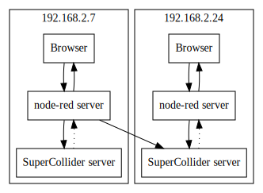
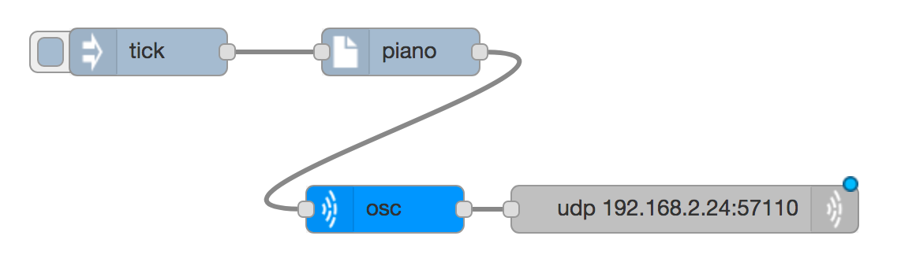

# Networking and Collaborating

## Networking and Internet Protocol (IP) addresses

We can join all of our computers together so they can send messages to each other. If each one has a speaker attached that means we can make sounds all around the room.

When a computer joins a network it is given an address (its Internet Protocol/IP address) which can be thought of like an electronic postcode. If the computer moves to a different network it is given a different IP address. To send a message to a computer you need to know its IP address. There may also be a name associated with an IP address - websites have a name in their web address, but we're not using names here. Most IP addresses are made up of four numbers with dots in between like `129.234.200.1`

Our little network is not interconnected with other networks (internetworking or internet for short) so we use a special set of IP addresses that start with 192.168.0. Because all of the computers on our network are running SuperCollider servers we can get our node-red servers to send synthesiser instructions to other computers like this

To send to another computer we can go back to our first sound flow (in [making music](making-music)) but configure the udp node to point to a different IP address (labelled "Address" in the configuration). Change 127.0.0.1, which will always point to the current machine, and replace it with a value starting with 192.168.0. as in this example

By replacing the last part of the IP address and trying it out, you should be able to work out the IP addresses of all the other machines on the network. Note that not all IP addresses will point to a computer.

Use this to make a list of the IP addresses of all the computers in the network.

## Collaborating

With all these music-enabled computers we have something much better than a stereo sound system because that only has two channels. Here each computer has its own channel of sound, and can send sound to any other channel.

Try sending a series of beats to different machines around the room by using the same `beat_of_bar` technique use in the `drumbeat` example. But this time, instead of sending the ticks to different synth types on the same machine, send them to the same synth type on different machines. You will need to import and reconfigure a `supercolliderOSC` for each machine that you send it to.

Putting all of these together will allow us to make some great collaborative music with really interesting textures. We know how to change the volume of things (dynamics) and the speed of things (tempo) as well as the sound they make (timbre) and the structure of the music in bars and sections. 