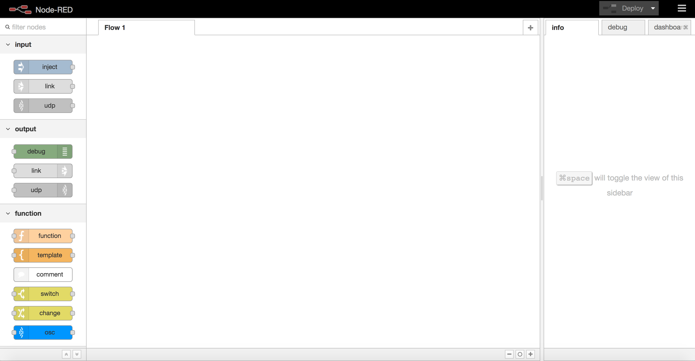
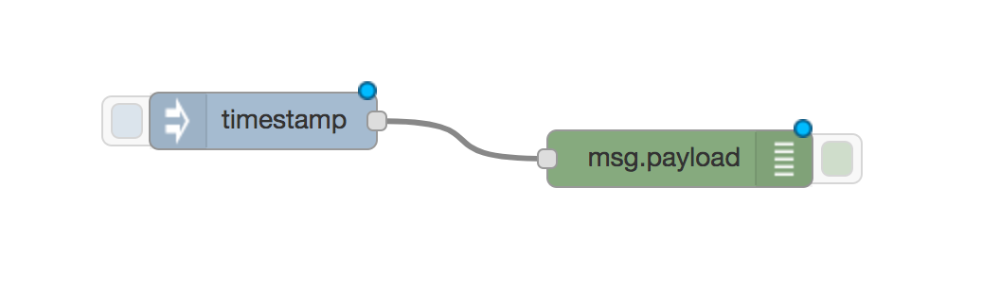
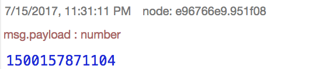
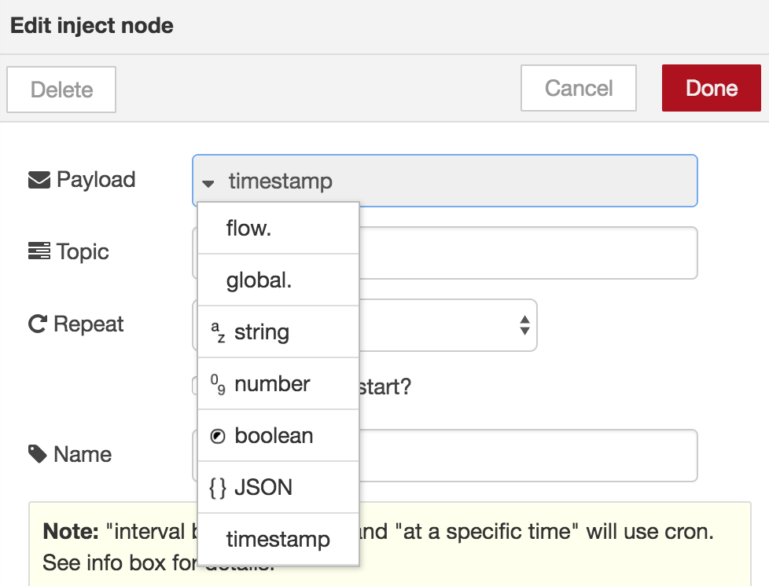
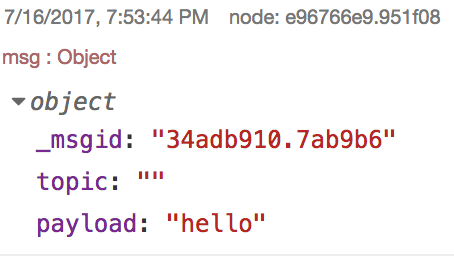

# node-red basics

## My first flow

Once you have your node-red server started and the browser pointing at
it correctly, you should have a screen looking something like this:

On the left-hand side is the _palette_, which has a list of different
types of _nodes_ you can choose to combine to make your _flow_ (which is
what node-red calls a program). You put them in the _workspace_ for the flow (the big
area in the middle, currently blank) by clicking and dragging them
from the palette. Each node can have _inputs_ and/or _outputs_. Inputs are on
the left-hand side of the box and outputs are on the right-hand
side, marked with a small rounded rectangle. Messages are passed from the output
of one node to the input of another node by connecting them with
_wires_. Our first example is going to have two nodes and one
wire as follows:

* Drag an `inject` node and a `debug` node into the workspace
* Add a wire from the output of the `inject` node to the input of the
 `debug` node by clicking on the output and dragging to the input (or
 anywhere on that node)

Now your workspace should contain nodes looking like this:

## Making it do stuff

So far you have edited your program but it isn't doing anything
yet. At this stage the program you have written is held inside the web
browser but you need to transfer it to the node-red server so that it
runs and actually does stuff. This process is called _deployment_ and
you do it by clicking on the "Deploy" button near the top right hand
corner which looks something like this:

If that works your program is running on the server. Every time you
make a change to the program by adding or removing nodes or wires you
have to deploy it again (_redeploy_ it).

Now if you click on the larger rounded rectangle on the left hand side
of the `inject` node (which is now called `timestamp`) then the server
will send a message on to all the nodes connected to its output, which
in this case is the `debug` node (which is now called
`msg.payload`). The debug node works by taking any input messages it
receives and prints them in the `debug` tab in the right-hand
sidebar. The output it shows is something like this:

If you click on the inject button again then a new message will appear
in the debug window.

## Node configuration

There are at least three mysteries in what we have looked at so far:

* What are the strange numbers that appear in the debug tab?
* Why did the `inject` node change its name to `timestamp`?
* Why did the `debug` node change its name to `msg.payload`?

The first two questions we can answer at once. The most important
number in the debug tab is the payload of the message i.e. its content, which appears in blue. Each time you
send a new message a different payload will be produced. This payload
is generated by the `inject` node when it is clicked, and is a measure
of the current time (to be precise, it is the number of milliseconds
since the 1st January 1970). However, you can change the `inject` node
to send a different payload instead. You do this by _configuring_ the
node, through double-clicking on the node and using this dialogue box

Different types of payload can be selected. By default it gives
_timestamp_ but if you change this to _string_ (which is a string of
characters i.e. some text) you can select what text you want to
send. This could be something friendly like "hello". Save this with
the "Done" button and redeploy your program. Now the title of the
`inject` node has changed and your message can be
seen when you click on the left-hand side of it.

You can probably now guess what the solution is to the third mystery by
looking at the configuration of the debug node. At the moment it
outputs `msg.payload` so change that to `complete msg object`, redeploy
and inject some more messages to see what the output looks like. Now
you should have something like this (once you have clicked on the
little triangle to expand the text)

Just in case you hadn't already worked it out, `msg` is short for
message, so `msg.payload` is the payload of the message. That is shown
by the text `payload: "hello"`. There is also something called
`_msgid` which is a unique identifier for the message (usually
ignored) and something written `topic: ""`. The quotation marks start
and finish with nothing in between, so this is what is called an empty
string. The topic is used to say what the message is about, but is
often left empty. If you go back and change the configuration of the
`inject` node you can add a `topic`, maybe to something like
`greeting`. By redeploying and injecting some more messages you should
see the topic being displayed.

In the object `msg` we have three _properties_, which are `_msgid`,
`topic` and `payload`. Messages can have as many properties as you
want, as long as each property has a different name. These properties
can also have different types. Originally the payload was a number
representing the time, now it is a string representing a greeting. If
you have built a flow that isn't doing what you're expecting you can
use a `debug` node anywhere to find out what messages are being
passed around between your nodes.

Next we are going use some other types of node specially designed for
[making music](making-music).