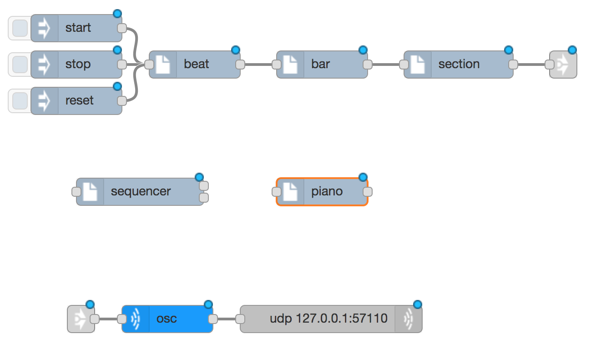
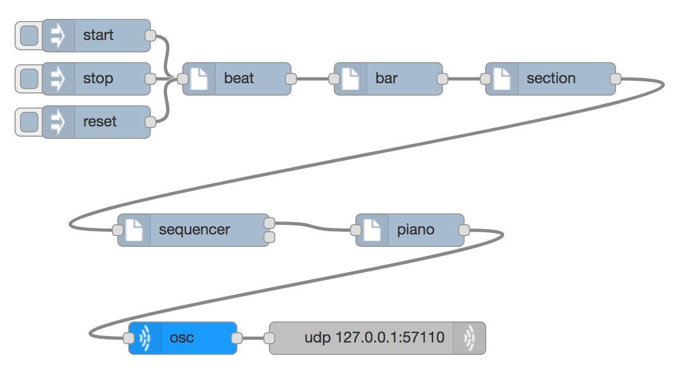
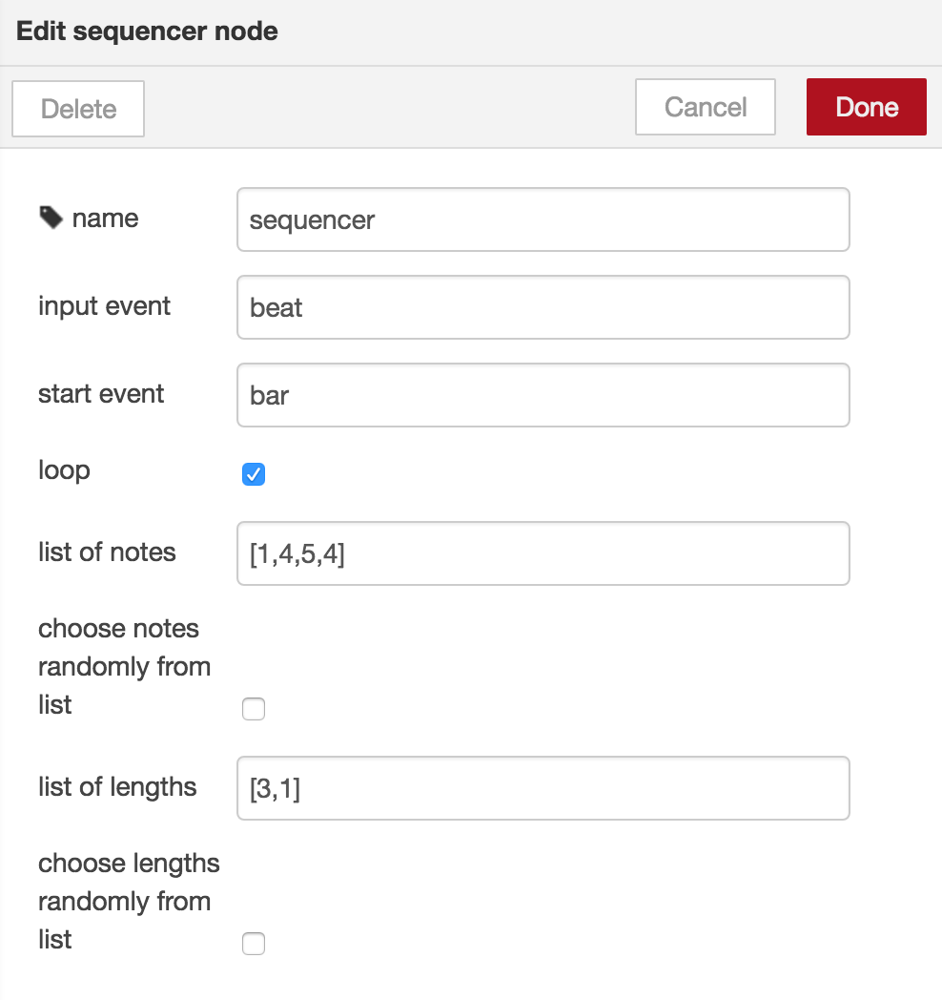

# Sequencing

## Note names and numbers

If you can read this you know the letters a, b, c, ... If you have learnt music before you may know that the letters a, b, c, ..., g can be used to describe the pitch of notes. Instead of the letters a, b, c, .... we can use the numbers 1, 2, 3, ... to describe pitches. Imagine putting the thumb of your right hand on one of the white keys of a piano. This is note number one. Note number two is the next white note, played with the next finger. As most people have five fingers that takes us from 1..5, but the higher numbers just keep on going up the piano keyboard. But because we are going to be using a computer, we don't need to stop at five, or to move our hands around the piano keyboard. Some people (like the von Trapps in the Sound of Music) use other names for these note numbers: do, re, mi, fa, so, ...

These pitches only apply to instruments that can play a tune (unlike most drums), so we are going to do this with a `sequencer` node that takes beats from a beat generator and feeds notes into a `piano` synth node.

## Using a sequencer

First delete everything you've got. If you want to save it before you delete it use the _Export_ menu option.

Next import a beatgenerator and a supercolliderOSC. In between them put a `sequencer` node and a `synth` node (piano) so you get something like this:

Delete the link nodes and join them all together like this:

When that is deployed and the beat is started you will hear a repeating pattern on the piano. Looking more closely at the sequencer configuration we can see how it works

The sequencer counts input events (beats) according to the `list of
lengths` in the configuration. When the next note is due, the note
number is taken from the `values of `notes`, and that changes the pitch
of the note that is sounded. These can be selected randomly, instead
of in the order they are entered. You have to use the square brackets
and commas as they are shown in the example, but you can have lists
that are shorter or longer for the `notes` and `list of
lengths`.

By default the sequencer will only send a tick at the next sequence
point, but you can configure it to send on all ticks it receives, but
with the value changing at sequence points.

Also you can add or change what value is sequenced. Instead of
changing the note, you might want to change the volume instead (or as
well). To sequence the volume, configure the `name` of the control to
be `volume` instead of `note`. To change both at the same time, you
can add a new control for the volume.

## Things to try

* Make a longer sequence of notes and lengths
* Use a synth that has sustain, such as moog. This synth is best for low notes, so configure the synth with an octave of -2. Leaving gaps is sometimes very effective, but if you want to do this with a sustaining synth you will need to use a null value e.g. [1,4,5,null]. Sustained synths will not work properly on other  computers
* Have two or more synths, each with their own sequencer, both running from the same beat generator
* Change the `input event` to be `bar` instead of `beat`, to make something run more slowly: the `list of lengths` will now count bars instead of beats
* Change the `scale type` setting on the synth to hear what difference they make
* Try 'phasing', as often used by the modern composer Steve Reich. First select quite a long list of notes, maybe eight of them, and a very simple list of lengths, maybe just the number 1. Then copy and paste the sequencer (use Ctrl-C and Ctrl-V) and add or remove one number from the list of lengths. Connect it up in the same way so that both sequencers are going at the same time. You can either feed the two sequencers into the same synth or give them each their own synth.
* Add in a drum beat at the same time (import it and connect it up). Having a simple list of lengths that do not add up to the bar length and playing it alongside the drum beat makes an interesting sound

As well as controlling the pitch of a note, you can [control other features of the sound](controlling-synths) too.